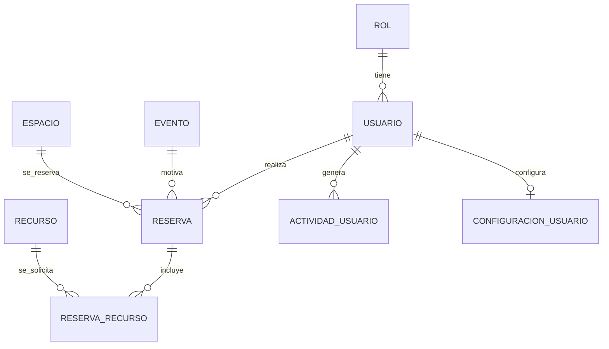

# Proyecto Gestión de Eventos (ASP.NET Core MVC)


Aplicación web para **gestionar eventos, espacios, recursos y reservas** en un contexto institucional (p. ej. universidad). Incluye **dashboard con métricas**, **búsqueda global**, **exportación a Excel/PDF**, **control de acceso por roles** y **auditoría de actividad**.

> Tecnologías clave: **.NET 9**, **ASP.NET Core MVC**, **Entity Framework Core + SQL Server**, **ClosedXML (Excel)**, **iTextSharp (PDF)**.

---

## Lo más destacable (para reclutadores)

- **Arquitectura MVC clara** con separación Controller/View/Model.
- **Persistencia real** con EF Core (SQL Server) y entidades relacionales: Reservas ↔ Espacios/Usuarios/Eventos + Recursos asociados.
- **Dashboard de gestión** con KPIs (reservas por estado, próximas reservas, top de espacios y recursos utilizados).
- **Búsqueda global tipo “command palette”** (reservas/espacios/eventos/recursos; usuarios solo para rol admin).
- **Exportaciones**:
  - Excel (`.xlsx`) vía ClosedXML
  - PDF (`.pdf`) vía iTextSharp
- **Seguridad y control de acceso**:
  - Autenticación por **cookies**
  - Sesión con `IdleTimeout`
  - Autorización por **roles** (módulo Usuarios restringido)
- **Auditoría**: registro de acciones (login/logout, cambios) asociado al usuario y metadata (IP/User-Agent).

---

## Demo funcional (qué hace el sistema)

### Módulos

- **Dashboard / Métricas**: [Controllers/HomeController.cs](Controllers/HomeController.cs)
- **Espacios (CRUD + exportar)**: [Controllers/EspaciosController.cs](Controllers/EspaciosController.cs)
- **Eventos (CRUD + exportar)**: [Controllers/EventosController.cs](Controllers/EventosController.cs)
- **Recursos (CRUD + exportar)**: [Controllers/RecursosController.cs](Controllers/RecursosController.cs)
- **Reservas (CRUD + validaciones + exportar)**: [Controllers/ReservasController.cs](Controllers/ReservasController.cs)
- **Usuarios (CRUD + exportar, solo admin)**: [Controllers/UsuariosController.cs](Controllers/UsuariosController.cs)

### Experiencia de usuario

- **Modo oscuro**: [wwwroot/css/dark-mode.css](wwwroot/css/dark-mode.css) y [wwwroot/js/dark-mode.js](wwwroot/js/dark-mode.js)
- **Búsqueda global** (AJAX/JS): [wwwroot/js/busqueda.js](wwwroot/js/busqueda.js)

---

## Modelo de datos (alto nivel)

El modelo está implementado con EF Core en [Models/ApplicationDbContext.cs](Models/ApplicationDbContext.cs).

Principales entidades:

- `Usuario` (con `Rol`)
- `Evento`
- `Espacio`
- `Recurso`
- `Reserva` (relaciona `Usuario`, `Evento`, `Espacio`)
- `ReservaRecurso` (asignación de recursos solicitados a una reserva)
- `ActividadUsuario` (auditoría)
- `ConfiguracionUsuario` (preferencias: tema, idioma, notificaciones, etc.)

Diagrama (conceptual) de relaciones:



---

## Requisitos

- **.NET SDK 9**
- **SQL Server** (recomendado: SQL Server Express + instancia `SQLEXPRESS`)

Paquetes NuGet destacados (ver [ProyectoGestionEventos.csproj](ProyectoGestionEventos.csproj)):

- `Microsoft.EntityFrameworkCore.SqlServer`
- `ClosedXML`
- `iTextSharp.LGPLv2.Core`

---

## Configuración

### 1) Connection string

Por defecto, el proyecto apunta a SQL Server Express:

- Archivo: [appsettings.json](appsettings.json)
- Clave: `ConnectionStrings:DefaultConnection`

Ejemplo:

```json
{
  "ConnectionStrings": {
    "DefaultConnection": "Server=localhost\\SQLEXPRESS;Database=gestionEventosDb;Trusted_Connection=True;TrustServerCertificate=True;"
  }
}
```

> Nota: También existe una connection string “hardcoded” en `OnConfiguring` del `DbContext` (típico cuando el modelo se generó con scaffolding). Para un entorno profesional, lo ideal es **centralizarla solo en configuración**.

---

## Ejecución local

En una terminal ubicada en la carpeta del proyecto (donde está el `.csproj`):

```bash
dotnet restore
dotnet run
```

Ruta inicial:

- `https://localhost:<puerto>/Home/Login`

---

## Base de datos

Este proyecto usa EF Core contra SQL Server.

- Si **ya tienes** la base `gestionEventosDb` (con tablas), basta con configurar el `DefaultConnection`.
- Si **no tienes** la base, puedes intentar generar el esquema con migraciones (depende de tu contexto de desarrollo):

```bash
dotnet ef migrations add InitialCreate
dotnet ef database update
```

Si EF te reporta conflictos de esquema, normalmente es porque:

- ya existe una base con tablas/relaciones, o
- el modelo fue scaffolded desde un esquema existente.

---

## Roles y permisos

- El módulo **Usuarios** está protegido por `[Authorize(Roles = "Administrador")]`.
- En el dashboard/búsqueda/registro de actividad, se consideran los roles **Administrador** y **SuperAdministrador**.

---

## Calidad y decisiones técnicas

- **Soft delete** en la mayoría de catálogos (`Estado = false`) y en reservas (`EstadoReserva = "Cancelada"`).
- **Validaciones de negocio** en reservas (fechas, disponibilidad, capacidad) y validaciones contra duplicados en catálogos.
- **Paginación reutilizable**: [Helpers/PaginatedList.cs](Helpers/PaginatedList.cs)
- **Auditoría desacoplada** como helper: [Helpers/ActividadHelper.cs](Helpers/ActividadHelper.cs)

---

## Mejoras futuras (backlog sugerido)

Si esto se lleva a producción, estas mejoras son las más valiosas:

- Hashing de contraseñas (`PasswordHasher`) y políticas de seguridad.
- Semillas iniciales (roles/usuario admin) vía EF Core.
- Mover por completo la connection string a configuración (evitar valores en `OnConfiguring`).
- Tests unitarios para validaciones de reservas y helpers.

---

## Autor

Bastián Ovalle - 2025
